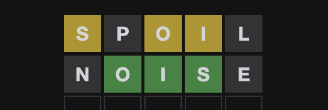

# **wordavailable**
A tool for [wordle](https://www.powerlanguage.co.uk/wordle/).

## **Deploy Url**

---
**[Here](http://34.81.42.124:4000/swagger/index.html)** -> Expiration date : 2022/05/01
## **How to use**

---

### Parameter Explanation
- length : the length of the word  
- rightPos : right alphabet at right position 
- wrongPos : right alphabet at wrong position   
- wrongAlphabet : wrong alphabet

### For Example

  

- In this case, fill the parameter with the value below to get available words.  
    - length : 5 
    - rightPos : 
    - wrongPos : 0s2o3i
    - wrongAlphabet : pl

  

- In this case, fill the parameter with the value below to get available words.  
    - length : 5 
    - rightPos : 1o2i3s
    - wrongPos : 
    - wrongAlphabet : plne

